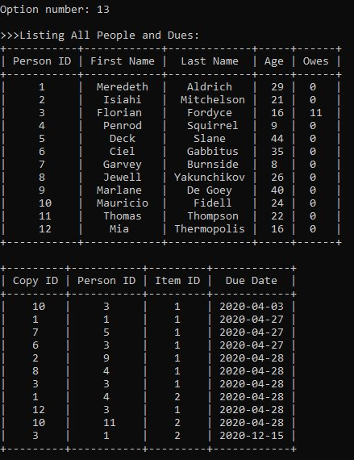

# Library Database

- Browser based IO Games using Node.js and socket.io packets 
- Mimicked a client server environment using web sockets 
- Client connections organized into unique rooms and can run independently

## Features

Chat Features:
- Users can join different rooms by each entering a player name and game id
- Users can assigned a unique identification color
- Users can send messages to other users in the room
- A notification is sent when a user joins or leaves the room
- Chatroom tracks the number of connected users, player name & color 
- Users can toggle chat display to show or hide chat


## How To Play





## How to Test

```
$ sudo pip3 install PTable
$ python3 librarydatabase.py
```


