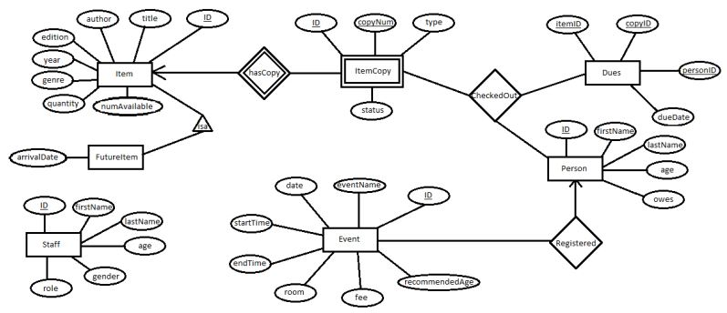

# Library Database

- Designed and built a real-world database application for Vancouver libraries
- Designed an entity-relationship model and drafted it into an E/R diagram 
- Ensured the schema meets the requirements and avoids anomalies
- Converted the E/R diagrams to table schemas for this database using sqlite
- Built the database application using Python and SQLite

## Features/ Specifications
- Users can find an item in the library
- Users can borrow an item from the library
- Users can return a borrowed item
- User can donate an item to the library
- Users can find an event in the library
- Users can register for an event in the library
- Users can volunteer for the library
- Users can ask for help from a librarian
- Users can list all items, people, dues and events

## E/R Diagram


## Schema
- Item (+ID+, title, author, edition, year, genre, quantity, numAvailable)
- ItemCopy (itemID, copyNum, type, status)
- FutureItem (ID, title, author, edition, year, genre, quantity, type, arrivalDate)
- Person (ID, firstName, lastName, age, owes)
- Registered (personID, eventID)
- Event (ID, eventName, date, room, startTime, endTime, fee, recommendedAge)
- CheckedOut (copyID, personID, itemID)
- Dues (copyID, personID, itemID, dueDate)
- Staff (ID, firstName, lastName, age, gender, role)

## Demo
- List all book items


- List all people and dues


- Return a book item


## How to Test

```
$ sudo pip3 install PTable
$ python3 librarydatabase.py
```


