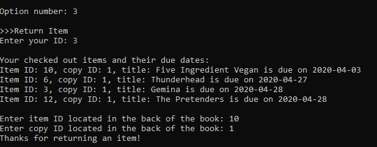

# Library Database

- Designed and built a real-world database application for Vancouver libraries
- Designed an entity-relationship model and drafted it into an E/R diagram 
- Ensured the schema meets the requirements and avoids anomalies
- Converted the E/R diagrams to table schemas for this database using sqlite
- Built the database application using Python and SQLite

## Features/ Specifications
- Users can find an item in the library
- Users can borrow an item from the library
- Users can return a borrowed item
- User can donate an item to the library
- Users can find an event in the library
- Users can register for an event in the library
- Users can volunteer for the library
- Users can ask for help from a librarian
- Users can list all items, people, dues and events

## E/R Diagram


## Schema
- Item (<ins>ID</ins>, title, author, edition, year, genre, quantity, numAvailable)
- ItemCopy (<ins>itemID</ins>, <ins>copyNum</ins>, type, status)
- FutureItem (<ins>ID</ins>, title, author, edition, year, genre, quantity, type, arrivalDate)
- Person (<ins>ID</ins>, firstName, lastName, age, owes)
- Registered (<ins>personID</ins>, <ins>eventID</ins>)
- Event (<ins>ID</ins>, eventName, date, room, startTime, endTime, fee, recommendedAge)
- CheckedOut (<ins>copyID</ins>, <ins>personID</ins>, <ins>itemID</ins>)
- Dues (<ins>copyID</ins>, <ins>personID</ins>, <ins>itemID</ins>, dueDate)
- Staff (<ins>ID</ins>, firstName, lastName, age, gender, role)

## Demo
- List all book items


- List all people and dues


- Return a book item




## How to Test

```
$ sudo pip3 install PTable
$ python3 librarydatabase.py
```


